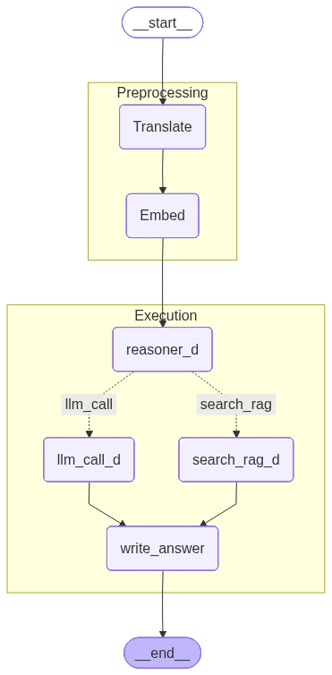

# deepthought

A local RAG assistant that answers questions about an operating-systems textbook and runs entirely on a Jetson Orin Nano (8 GB). No cloud, no API keys: Ollama for the LLM and embeddings, PostgreSQL + pgvector for retrieval, LangGraph for the control flow, FastAPI in front.

Built as a university team project (FOM, "Projekt Edge Computing", WS 2025). I did the initial device bring-up and implemented the stack; a teammate did the OS hardening. The interesting part is not the RAG itself but what 8 GB of shared memory forces you to do differently.

## What it does

1. **Preprocessing** – translates the question to English and embeds it (`nomic-embed-text`).
2. **Routing** – a structured-output call classifies the intent: `operating_system` → retrieval, `general` → plain chat.
3. **Execution** – either a pgvector cosine search over the chunked textbook, or a short chat completion over the last four messages.
4. **Answer** – one final rephrasing call. Retrieval answers must cite page numbers `(Page X)` and may only use the retrieved text.



## Why it looks like this

**Routing instead of ReAct.** The first version was a ReAct agent with retrieval as a tool. Yao et al. already note that small models do not process ReAct's reasoning chains stably, and that matched what we saw on a 3B model: it worked once, and otherwise either looped without ever producing a final answer or never got the reason/act decision right. Replacing the loop with one structured-output classification (`IntentResult`, a Pydantic schema enforced by Ollama) made the behaviour deterministic enough to ship: the model decides *once*, the graph does the rest. `granite4:3b` was chosen because it supports function calling and structured output at a size that fits next to the embedding model.

**Translate first.** `granite4:3b` is labelled multilingual, but its training data is predominantly English, so English is the language it handles most reliably. Users ask in German; the translation step also silently fixes typos before the question is embedded.

**Bounding memory and latency.** Self-attention is quadratic in context length, and on the Jetson the LLM, the embedding model, Postgres and the OS share the same 8 GB. The knobs that matter:
- chat history is truncated to the last 4 messages before the final call,
- `top_k = 2` chunks of 500 characters (100 overlap) per retrieval,
- `num_predict = 2048`, `temperature = 0.2`.

Answers took several seconds on the device; I did not keep measurements.

**Models.** `LlmApiModel` in `src/context/deepthought_context.py` lists what I tried. `granite4:3b` was the first model where structured output and function calling were stable at a size that fits next to the embedding model; I did not keep systematic notes on why the others fell out, so the enum is a record of what was tried, not a ranking.

**Chunking by characters, per page.** Pages are chunked individually so every chunk carries its page number, which is what makes the `(Page X)` citations possible. Character-based rather than token-based chunking keeps the ingestion dependency-free.

**State across requests.** HTTP is stateless; LangGraph's `InMemorySaver` checkpointer keyed by `thread_id` carries the conversation between calls. In-memory is fine for a prototype and costs nothing on the device; it does not survive a restart.

## Device setup

What it took to get a fresh Jetson Orin Nano into a state you can develop against remotely. The bring-up (first two points) was mine; hardening, kernel tuning and the database setup were done by a teammate and are listed because they are half the project.

- JetPack flashed via SD card, firmware updated, system brought to a usable baseline.
- Root filesystem migrated from SD card to NVMe (`parted`, `rsync`, boot entry in `/boot/extlinux/extlinux.conf`); the bootloader stays on the SD card as NVIDIA recommends.
- iptables with default `DROP` on `INPUT`; only established/related, 22 (SSH), 5432 (Postgres) and 8000 (FastAPI) are open. `avahi-daemon` disabled. Tailscale for remote access, since the team was spread across Germany.
- Kernel tuned for Postgres: `vm.swappiness = 10`, `vm.overcommit_memory` / `vm.overcommit_ratio` set so the database is not OOM-killed under memory pressure, persisted via `/etc/sysctl.d/`.
- PostgreSQL 18 from the official repository, cluster re-created with `scram-sha-256`, pgvector compiled from source.
- Ollama and the API run as systemd services.

## Stack

LangGraph 1.x (two compiled subgraphs inside a main graph) · LangChain-Ollama · PostgreSQL 18 + pgvector (768-dim, cosine) · FastAPI/uvicorn · pypdf · uv · Ubuntu 22.04 on JetPack 6

## Running it

```bash
# 1. Ollama with the models
ollama pull granite4:3b
ollama pull nomic-embed-text

# 2. PostgreSQL with pgvector, then
cp .env.example .env   # fill in PG_* (or point PGPASS_PATH at a .pgpass file)

# 3. Install and ingest the corpus (see demo/db_insert.ipynb)
uv sync

# 4. Serve
uv run uvicorn run:app --app-dir src --host 0.0.0.0 --port 8000
```

```bash
curl -X POST localhost:8000/start \
  -H 'content-type: application/json' \
  -d '{"thread_id": "demo", "user_question": "Was ist ein Context Switch?"}'
```

The corpus is Max Hailperin's *[Operating Systems and Middleware: Supporting Controlled Interaction](https://gustavus.edu/mcs/max/os-book/)* (CC BY-SA 3.0). Download the PDF from the author's site and place it at `src/db/documents/Operating_Systems.pdf` before running the ingestion notebook; it is not committed here.

## What I would do differently

- Connection pooling instead of one Postgres connection per request.
- Return partial state updates from the LangGraph nodes instead of mutating the `TypedDict` in place; it works, but it is not idiomatic.
- Hybrid retrieval: BM25 next to the cosine search, so exact terms like syscall names are not lost in the embedding.
- Token-based chunking and a real eval set: right now "does it cite the right page" is checked by hand.
- A persistent checkpointer once the prototype has to survive restarts.

## Layout

```
src/
  run.py                      FastAPI entrypoint
  settings.py                 configuration (env / .env / .pgpass)
  agent_workflow/
    main_graph.py             Preprocessing -> Execution
    preprocessing_step/       translate + embed
    execution_step/           intent routing, retrieval, chat, final answer
    state.py                  AgentState
  context/                    Ollama client + model registry
  db/                         pgvector schema, ingestion, similarity search
demo/                         ingestion and client notebooks
exploration/                  scratch notebooks from development
```
